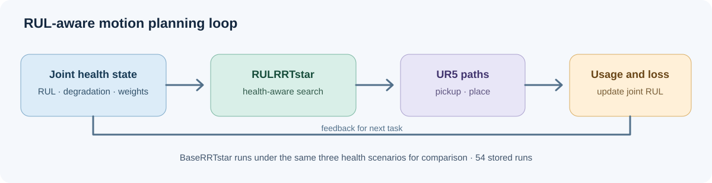

<div align="center">

# Custom Planners in OMPL & MoveIt

### From your own RRT* class to a reproducible RUL-aware planning study

**自定义规划器接入教程 · RUL-aware RRT* 设计 · 三场景实验与结果**

[](docs/01_环境与规划器注册.md)
[](docs/01_环境与规划器注册.md)
[](docs/02_实验运行与结果.md)

**[Add a planner](#add-a-custom-planner--添加自定义规划器) · [RUL-aware design](#rul-aware-rrt-design--规划器设计) · [Results](#experiments-and-results--实验与结果) · [Reproduce](#reproduce--复现) · [Source map](#repository-map--代码导航)**

</div>

This repository is a worked example of **designing a custom OMPL planner and making it selectable in MoveIt 1**. The concrete method is `RULRRTstar`: an RRT* variant that uses joint remaining useful life (RUL) in neighbor selection and path cost. `BaseRRTstar` provides a path-length comparison. The package includes the C++ implementation, a registration script, a reproducible integration guide, and 54 recorded runs across three joint-health scenarios. **UR5 is the experimental platform, not the subject or limit of the planner-design guide.**

本仓库首先回答“自己设计的规划器怎样接入 OMPL 与 MoveIt”；然后以 `RULRRTstar` 展示寿命感知的近邻度量与路径代价设计，并提供三场景实验、原始数据和结果核验。UR5 是这里使用的实验平台。



> **Integration boundary / 接入边界：** These C++ planners implement OMPL APIs and publish ROS topics. They are therefore compiled into MoveIt's `moveit_ompl_interface`, registered under `geometric::RULRRTstar` and `geometric::BaseRRTstar`, then exposed through a MoveIt planner configuration. This is the integration pattern demonstrated here; the code is not a standalone `libompl` plugin. / 规划器遵循 OMPL API，同时使用 ROS 话题，因此本例将源码编入 MoveIt 的 OMPL 接口库，再通过规划器 ID 和 YAML 配置供 MoveIt 选择。

## Add a custom planner / 添加自定义规划器

The [step-by-step integration guide](docs/01_环境与规划器注册.md) shows the exact files, commands, source revisions, build steps, and registration checks. The transferable sequence is: / [接入教程](docs/01_环境与规划器注册.md) 给出具体文件、命令、依赖版本和验证方法；核心步骤如下：

| Step | Where in this repository | What it does |
| --- | --- | --- |
| 1. Implement the planner / 实现规划器 | [`planner/src/ompl/geometric/planners/rrt/`](planner/src/ompl/geometric/planners/rrt/) | Define the OMPL planner class, `setup()` and `solve()` behavior / 定义规划类与搜索逻辑 |
| 2. Define its objective / 定义代价 | [`planner/src/ompl/base/objectives/`](planner/src/ompl/base/objectives/) | Supply the RUL-aware edge cost and baseline path-length cost / 提供代价函数 |
| 3. Compile into MoveIt / 编入 MoveIt | [`tools/register_moveit.py`](tools/register_moveit.py) | Add source files, include path and ROS dependency to `moveit_ompl_interface` / 修改编译接线 |
| 4. Register planner IDs / 注册 ID | [`docs/01_环境与规划器注册.md`](docs/01_环境与规划器注册.md) | Add planner allocators in `planning_context_manager.cpp` / 在接口中实例化规划器 |
| 5. Expose and verify / 配置与验证 | [`ros/ur5_moveit_config/config/ompl_planning.yaml`](ros/ur5_moveit_config/config/ompl_planning.yaml) | Make the IDs available to MoveIt's `manipulator` group, build and check / 声明 ID 并检查构建 |

The C++ sources are an example to adapt when designing another planner. The supplied registration script targets the pinned MoveIt 1 source layout and checks expected code anchors before editing it. A different ROS/MoveIt generation or robot configuration needs its own integration changes. / C++ 源码可作为设计其它规划器的参考；自动接线脚本针对仓库固定的 MoveIt 1 版本，换版本或机器人配置时需相应调整。

## RUL-aware RRT* design / 规划器设计

`RULRRTstar` reads the six joint RUL values and degradation weights before a planning request. Relative to ordinary path-length RRT*, it changes the neighborhood metric and optimization objective, while retaining an RRT* search structure. The experiment runner measures planned-path joint usage, updates RUL and gamma, then provides the next health state. / 规划前读取关节 RUL 与退化权重；规划器改动近邻度量与优化目标；实验脚本根据规划路径更新下一任务的健康状态。

| Component | Implemented behavior | Source |
| --- | --- | --- |
| Health input / 健康参数 | Shared 16-column CSV: 6 RUL, 6 gamma, `lambda`, `alpha`, `rulmin`, `epsilon` | [`run_experiment.py`](experiment/run_experiment.py), [`RULRRTstar.cpp`](planner/src/ompl/geometric/planners/rrt/src/RULRRTstar.cpp) |
| Neighbor metric / 近邻度量 | Joint displacement weighted by RUL and gamma; denominator uses `max(RUL_j, rulmin)` | [`RULRRTstar.cpp`](planner/src/ompl/geometric/planners/rrt/src/RULRRTstar.cpp) |
| Edge objective / 路径代价 | Default `fixed1000` mode uses `Σ (alpha + lambda·gamma_j) · |Δq_j| / (max(RUL_j/1000, 0.05) + epsilon)` | [`RULAwareOptimizationObjective.cpp`](planner/src/ompl/base/objectives/src/RULAwareOptimizationObjective.cpp) |
| Comparison / 对照 | Separate `BaseRRTstar` with path-length objective | [`BaseRRTstar.cpp`](planner/src/ompl/geometric/planners/rrt/src/BaseRRTstar.cpp) |

The neighbor metric and objective use **different RUL normalization rules** in this recorded implementation. See the [algorithm walkthrough](docs/03_源码与算法.md) before changing either formula or interpreting the experiments. / 当前版本的近邻度量与目标函数采用不同的 RUL 归一化规则；修改算法或解释结果前请阅读[源码与算法说明](docs/03_源码与算法.md)。

## Experiments and results / 实验与结果

The packaged study compares both planners in full health (FHS), heterogeneous degradation (HDS), and local degradation (LDS). Each scenario uses degradation shape `p ∈ {0.8, 1.0, 1.5}` and three repetitions per planner and shape: **3 × 3 × 2 × 3 = 54 runs**. UR5 pickup/place requests use MoveIt fake execution; the original runner plans paths but does not command a physical robot. / 三种健康状态、三种退化形状、两种规划器、每组重复三次。UR5 取放任务仅用于仿真规划，不驱动实体机器人。

**LDS: mean completed tasks until the minimum-RUL stopping rule / 局部退化：达到最小 RUL 阈值前的平均任务数**

| Shape `p` | BaseRRTstar | RULRRTstar | Difference |
| ---: | ---: | ---: | ---: |
| 0.8 | 18.67 | 27.67 | +9.00 |
| 1.0 | 33.00 | 51.67 | +18.67 |
| 1.5 | 73.67 | 111.67 | +38.00 |

Each value averages three stored runs. FHS and HDS groups all reached their 80-task cap, so task count alone cannot distinguish those planners; the [full summary](docs/02_实验运行与结果.md) also covers final joint RUL. These results describe this specific simulated study, not measured physical robot lifetime. / 每项为三次运行均值；FHS 和 HDS 均达到 80 个任务上限，需结合最终关节 RUL 分析。结果仅代表本仿真实验。

The original `BaseRRTstar` does not publish a fresh `/joint_loss`. Its saved loss CSV can contain a latched value from a previous RUL-aware run; compare task counts and RUL trajectories from the main and usage files instead. / 基线的 loss CSV 可能包含上次话题的残留值，请使用主 CSV 和 usage 文件比较。

## Reproduce / 复现

**Check the packaged results on any Python 3 machine / 无需 ROS，先核对已发布数据：**

```bash
git clone https://github.com/HelpLee/MotionPlanning_RULRRTstar.git
cd MotionPlanning_RULRRTstar
python3 tools/check_package.py
python3 analysis/experiment_table.py --check-stored-summary
```

Both commands use the Python standard library. To check all initial gamma traces, install NumPy and run `python3 analysis/check_gamma_trace.py`. / 前两条仅用标准库；检查 gamma 轨迹另需 NumPy。

**Build and rerun planning / 构建并重跑规划：** Use Ubuntu 18.04, ROS Melodic, MoveIt 1 and OMPL 1.4.2. Follow [environment and planner registration](docs/01_环境与规划器注册.md), then [the experiment protocol](docs/02_实验运行与结果.md). Pinned third-party commits are in [`tools/source-revisions.json`](tools/source-revisions.json). The full experiment needs a ROS/catkin environment; the commands above validate the published package and data. / 完整实验需要 ROS/catkin 环境，依赖版本与命令见教程。

## Repository map / 代码导航

| Path | Purpose |
| --- | --- |
| [`planner/src/ompl/`](planner/src/ompl/) | Custom planners and objectives / 规划器与目标函数 |
| [`tools/register_moveit.py`](tools/register_moveit.py) | MoveIt 1 source registration / MoveIt 接线脚本 |
| [`docs/01_环境与规划器注册.md`](docs/01_环境与规划器注册.md) | Build and integration tutorial / 环境与接入教程 |
| [`docs/03_源码与算法.md`](docs/03_源码与算法.md) | Design and data flow / 算法与数据流 |
| [`experiment/run_experiment.py`](experiment/run_experiment.py) | Scenario runner / 三场景实验入口 |
| [`data/joint_usage_1/`](data/joint_usage_1/) · [`analysis/`](analysis/) | Raw runs, summaries, checks / 数据、汇总与核验 |
| [`archive/local_history_20250930/`](archive/local_history_20250930/) | Original source snapshots and hashes / 历史源码与哈希 |

## Citation and reuse / 引用与复用

Use [`CITATION.cff`](CITATION.cff) to cite this software. A formal paper link will be added when available. No project-wide software license has been declared; check the licenses of third-party sources before reuse or redistribution. / 请用引用文件引用本软件；正式论文信息尚待补充。当前尚未声明覆盖整个仓库的许可。

README structure adapted to this project from the [Papers with Code research-code README template](https://github.com/paperswithcode/releasing-research-code/blob/master/templates/README.md).
